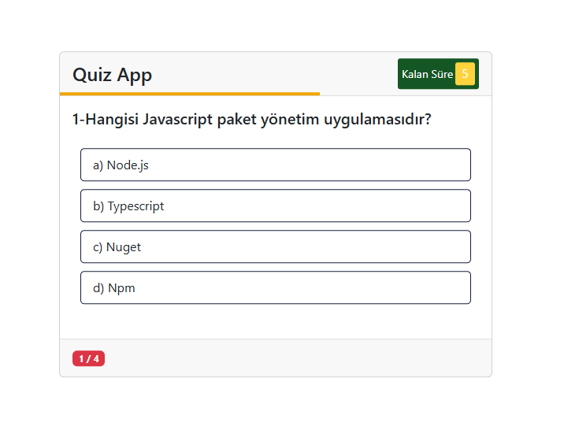

## 🚀 Application Preview

🧠 Quiz App Web Application

Bu proje, saf HTML, CSS ve JavaScript kullanılarak geliştirilmiş interaktif bir Quiz (Bilgi Yarışması) uygulamasıdır.
Kullanıcılar belirli bir süre içerisinde soruları cevaplar ve test sonunda doğru sayısını görebilir.

✨ Özellikler

Her soru için geri sayım sayacı

Akan süre barı (progress timer line)

Süre dolduğunda şık seçiminin devre dışı kalması

Doğru cevap seçildiğinde görsel geri bildirim (✔️)

Yanlış cevap seçildiğinde görsel geri bildirim (❌)

Her sorudan sonra otomatik geçiş

Test sonunda toplam skor ekranı

“Replay” butonu ile testi yeniden başlatma

Responsive tasarım

----------------------------------------------------------------------------------------------------------

🧠 Quiz App Web Application

This project is an interactive Quiz Application built using pure HTML, CSS, and JavaScript.
Users must answer questions within a limited time and receive instant feedback for each answer.

✨ Features

Countdown timer for each question

Animated progress timer bar

Option selection disabled when time runs out

Visual feedback for correct answers (✔️)

Visual feedback for incorrect answers (❌)

Automatic transition to the next question

Final score screen showing total correct answers

Replay button to restart the quiz

Fully responsive design
